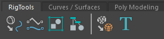
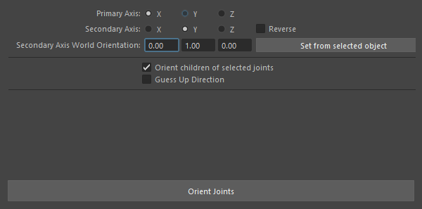

# Maya-RigTools
a simple rigging tools in maya.

  

## Instructions
a simple tool-kit for rigging in maya. Those tools merged commonly used sequential-operation into one click button. 
It makes rigging much more convenit.
**For maya 2018, maya 2019**

  
**Edge 2 Curves**  
Create curves from polygon's edges  
**USAGE:**  
Select polygon's edges, execute.  
`
Single click: curves with 1 degree.  
Double click: curves with 3 degree.
`  

  
**Merge Curves**  
Merge selected curves' shape into one object.  
**USAGE:**  
Select at least one curve, execute.  

  
**Match Transform**  
Match Transform two objects' transform.  
**USAGE:**  
Select the object, than the target, execute.  
`Double click: only effect pivot.`  

  
**Group It**  
Group the every selected object at same position, than transfer items' transformation to it's group.  
**USAGE:**  
Select at least one object, execute.  

  
**Space Switch Setup**  
Create a space switching system form selection.  
**USAGE:**  
Select target1, target2, ..., contained, execute.  

  
**Orient Joint**  
Orient Joint to custom world up.  
**USAGE:**  
Select at least one joint, execute.  
  
Set parameters, press button.  

  
**Save or Load Transform**  
Save or load selected object's transform  
**USAGE:**  
Select only one object, execute.  

  
**Rename It**  
rename both item's group and itself.  
**USAGE:**  
Select only one object, execute.  

  
**Toggle Display**  
Display only meshes and curves or not.  
**USAGE:**  
Choose display mode.  

  
**Toggle LocalAxis**  
Toggle display of LocalAxis.  
**USAGE:**  
Select at least one object, execute.  

## How to install
1. Simply put folder **'rigTools'** under **'Script Path'**  
**Script Path:**  
- Windows: <drive>:\Documents and Settings\<username>\MyDocuments\maya\<Version>\scripts
- Mac OS X: ~/Library/Preferences/Autodesk/maya/<version>/scripts.
- Linux: ~/maya/<version>/scripts.  

2. Edit **'userSetup.py'** under **'Script Path'**  
```python
import maya.cmds as cmds
from rigTools import install

cmds.evalDeferred("install.start()")
```  
Add it at last line.

**Or simply put the offered 'userSetup.py' into 'Script Path'**: